# Processo – Trabalho 2 (Navegação)

Este documento conta como o **APP RPG** evoluiu do Trabalho 1 até aqui e quais decisões o trio (Bruno, Gabriela e Michelle) tomou no caminho. Todos os prints estão em [`docs/prints/`](docs/prints/).

---

## 1. Como estava o projeto no Trabalho 1, e o que mudou?

No Trabalho 1 o app tinha três telas, trocadas por uma barra inferior simples: **Dados**, **Ficha** e **Música**. A tela de **Dados** era a única funcional: ela interpreta expressões como `2d6+3` e mostra média, mediana, mínimo, máximo e a distribuição dos resultados. A **Ficha** e a **Música** eram só layout, com valores fixos e sem interação.

A navegação era um `when` sobre uma variável de estado (`var current by rememberSaveable { mutableStateOf(Destination.Dice) }`), sem pilha de telas, sem botão de voltar e sem passagem de dados entre telas.

| Dados (funcional) | Ficha (estática) | Música (estática) |
|:---:|:---:|:---:|
| 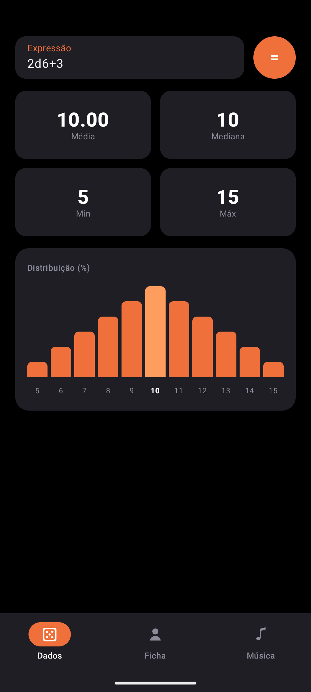 | 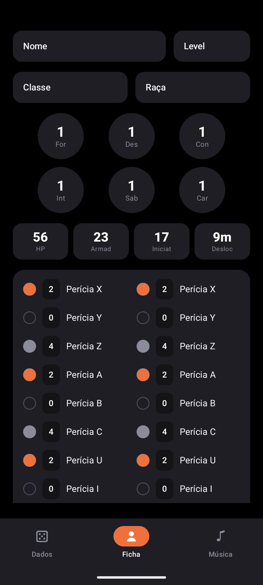 | 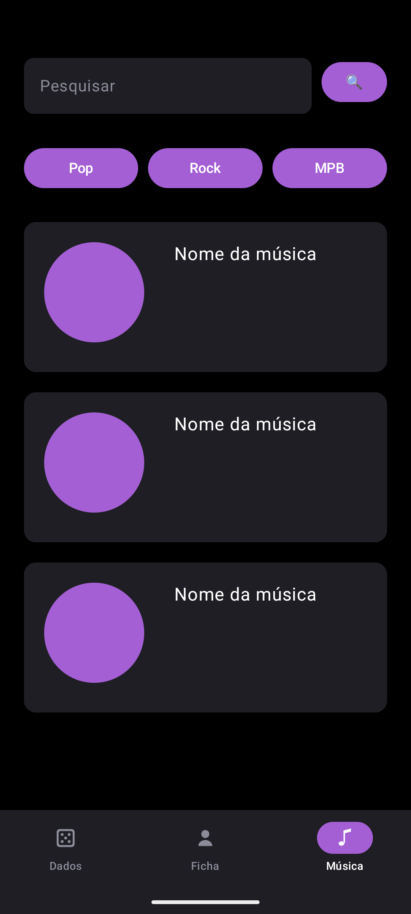 |

Para o Trabalho 2, mudamos:

- **Navegação:** o `when` foi substituído por `NavHost` + `NavController`, com rotas declaradas em um objeto `Routes`, `navigate(...)` para avançar e `popBackStack()` para voltar.
- **Top bar:** foi adicionada uma `TopAppBar` com título dinâmico, subtítulo e seta de voltar nas telas internas.
- **Modos Jogador e Mestre:** o último botão da barra inferior alterna entre os dois modos. Cada modo tem suas próprias abas e sua cor: **laranja** para o Jogador e **roxo** para o Mestre.
  - Jogador: Dados, Ficha, Lojas
  - Mestre: Música, Itens, Lojas
- **Telas novas:** todas são de **lojas** e **itens** (seção 2).
- **Ficha:** agora é editável. Nome, nível, classe, raça, atributos, status e perícias podem ser alterados, com botões de Salvar e Cancelar.

| Ficha editável (Jogador) |
|:---:|
| 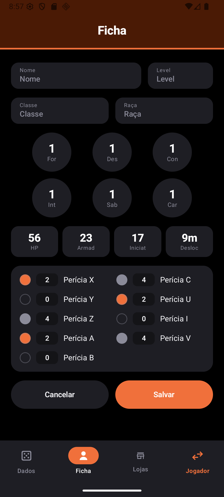 |

---

## 2. Por que essas telas novas?

Escolhemos telas de **lojas** e **itens** porque elas se encaixam bem: o Mestre cadastra os itens do mundo, monta as lojas com esses itens, e os jogadores visitam as lojas para comprar. É uma parte comum de qualquer sessão de RPG, e as duas listas ficam ligadas entre si (seção 4).

### Itens (Mestre)
A lista de itens usa `LazyColumn` + `Card`, com os dados em um `mutableStateListOf`. Cada card mostra a categoria, o nome, a descrição e o valor. O botão **+** abre o cadastro, o lápis abre a edição e a lixeira pede confirmação antes de excluir.

| Lista vazia | Lista de itens | Excluir item |
|:---:|:---:|:---:|
| 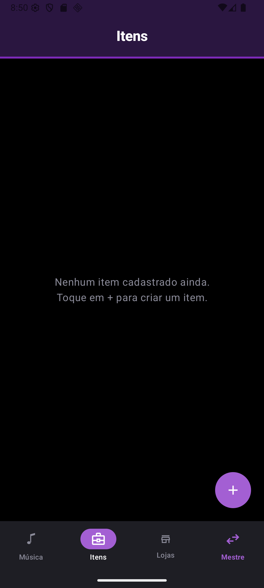 | 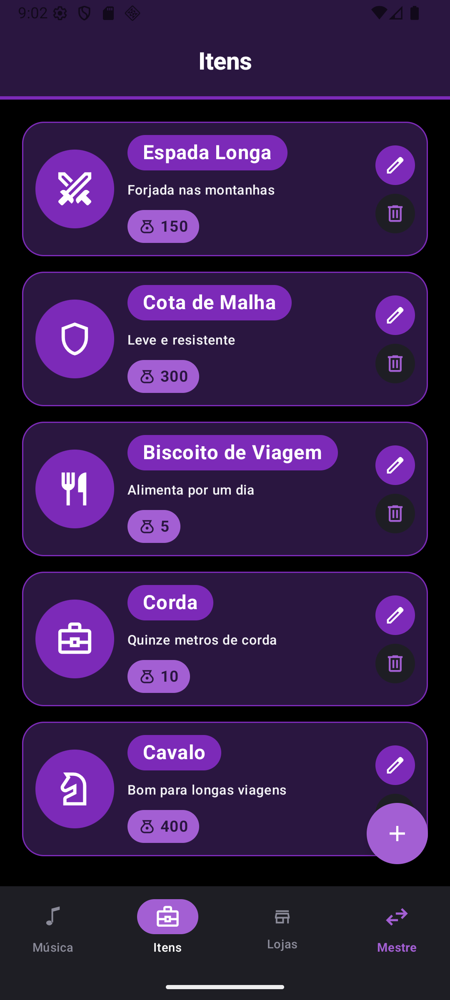 | 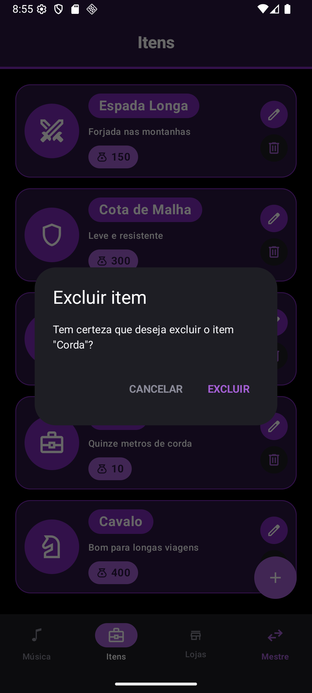 |

A mesma tela de formulário serve para **criar** e **editar** um item. Na edição, a tela recebe o `itemId` pela rota (`item_registration?itemId=3`), busca o item na lista e preenche os campos. Por isso consideramos essa a nossa tela de **detalhes do item**.

| Criar item | Editar item (detalhes) |
|:---:|:---:|
| 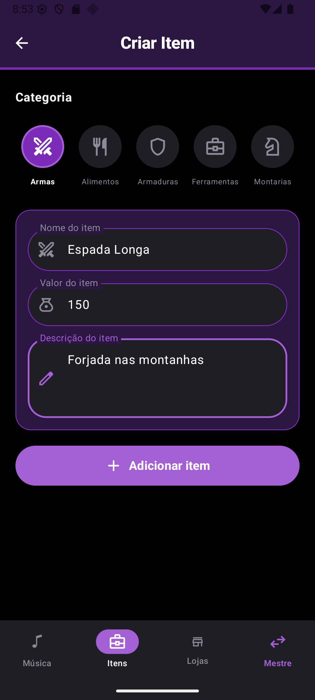 | 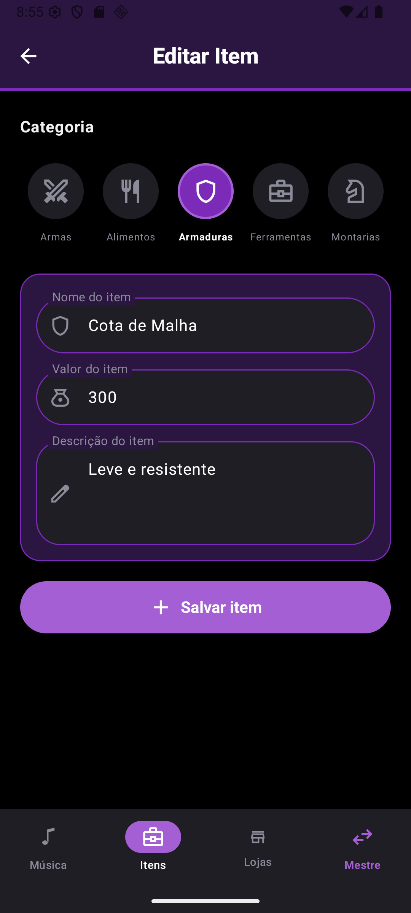 |

### Lojas (Mestre e Jogador)
A lista de lojas também usa `LazyColumn` + `Card` + `mutableStateListOf`, mas muda conforme o modo:

- **Mestre:** pode criar, editar e excluir lojas. Tocando no ícone da loja, ele a **oculta** ou **mostra** para os jogadores, como o Mercado Negro no print abaixo.
- **Jogador:** vê só as lojas visíveis, sem botões de edição.

| Lojas (Mestre) | Lojas (Jogador) | Criar/editar loja |
|:---:|:---:|:---:|
| 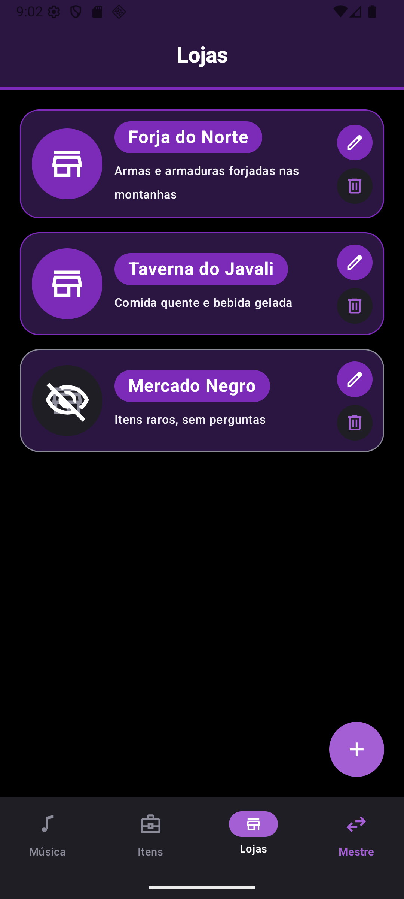 | 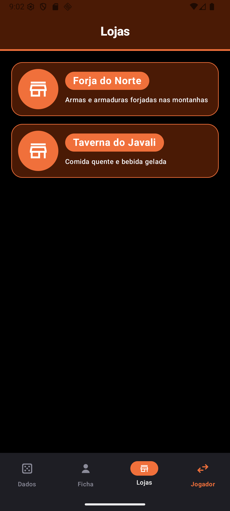 | 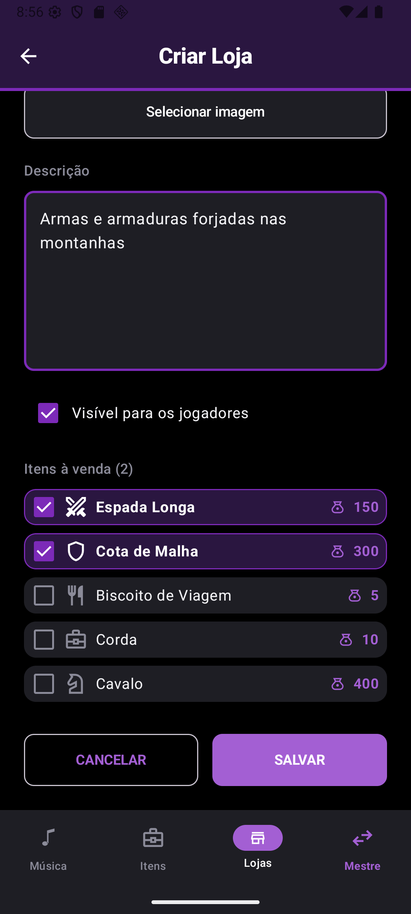 |

Ao tocar em uma loja, abre a **tela de detalhes da loja**. Ela recebe o `storeId` pela rota (`store/{storeId}`) e mostra:
- o nome da loja no título
- quantos itens ela vende, no subtítulo
- a descrição da loja
- os itens à venda

O Mestre pode remover itens da loja, e o Jogador pode comprá-los.

| Detalhes da loja (Mestre) | Detalhes da loja (Jogador) |
|:---:|:---:|
| 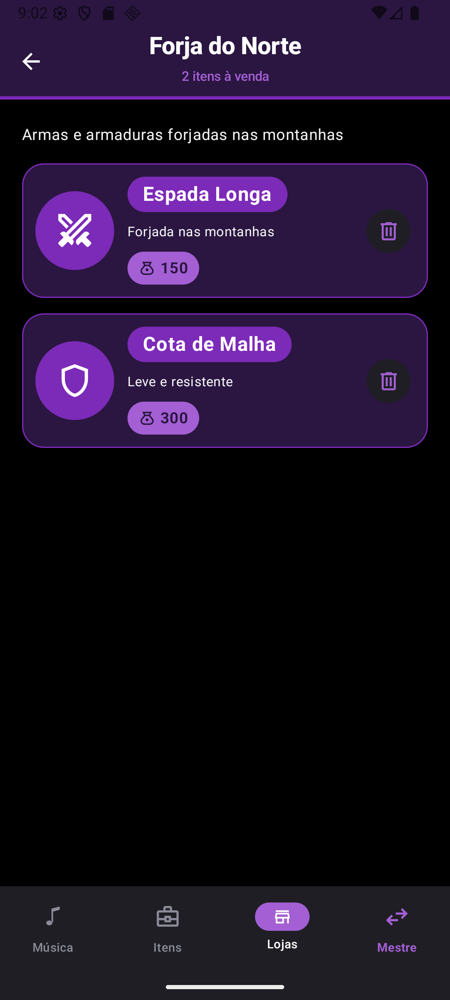 | 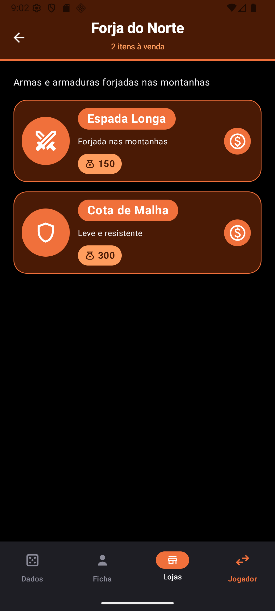 |

---

## 3. Decisões de configuração e organização do código

- **Rotas centralizadas no objeto `Routes`** (`MainActivity.kt`). As rotas ficam em constantes, junto com funções que montam a rota com o argumento, como `Routes.store(id)` e `Routes.itemRegistration(id)`. Assim ninguém escreve a string da rota "na mão" em vários lugares. A rota de cadastro usa um argumento **opcional** (`?storeId=` / `?itemId=`, padrão `-1`): sem id, a tela cria; com id, ela edita.
- **As listas ficam no `App()`.** `lojas` e `itens` são `mutableStateListOf` criados uma vez no `App()` e passados para as telas como parâmetro. As telas recebem os dados e devolvem eventos (`onSave`, `onDelete`, `onEdit`...), e quem altera a lista é sempre o `App()`. Isso deixa as telas simples e garante que todas vejam os mesmos dados, guardados só em memória.
- **Um único `NavHost`** dentro do `Scaffold`. A `TopAppBar` e a `NavigationBar` ficam fora dele e mudam conforme a rota atual (`currentBackStackEntryAsState()`). Por exemplo, o título vira o nome da loja na tela de detalhes, e a seta de voltar aparece só fora das abas.
- **Abas com `enum class Destination`.** Cada aba conhece a sua rota e as **rotas internas** que pertencem a ela. Assim a aba "Lojas" continua selecionada na tela de detalhes e no cadastro de loja. A troca de aba usa `popUpTo(startDestination)` + `saveState`/`restoreState`, para não empilhar telas repetidas.
- **Modos com `enum class Mode`.** Cada modo define suas abas e sua paleta de cores. A paleta é passada para todas as telas por um `CompositionLocal` (`LocalModePalette`), então nenhuma tela precisa saber em que modo está para escolher a cor. Ao trocar para o Jogador em uma tela exclusiva do Mestre, o app volta para uma tela disponível.

---

## 4. Complexidade extra na tela de Detalhes

A complexidade extra é a **ligação entre lojas e itens**. Cada `LojaRpg` guarda o conjunto de ids dos itens que vende (`itemIds: Set<Int>`):

- No **cadastro e na edição da loja**, existe a seção **"Itens à venda"**. Ela lista todos os itens cadastrados, e o Mestre marca quais a loja vende (print "Criar/editar loja" acima).
- A **tela de detalhes da loja** mostra só os itens daquela loja, e não todos os itens do app. O subtítulo conta quantos são.
- A tela muda conforme o modo:
  - **Mestre:** cada item tem um botão para removê-lo da loja; isso não apaga o item do catálogo. Tocar no item abre a edição dele.
  - **Jogador:** cada item tem o botão de **comprar**.
- **Os dados ficam consistentes:**
  - Editar uma loja mantém os itens dela.
  - Excluir um item na aba Itens também o remove de todas as lojas.
  - Editar um item atualiza nome e valor em todas as lojas que o vendem, porque elas guardam só o id.

Escolhemos essa porque é o que dá sentido às duas listas juntas. Sem a ligação, a loja mostrava todos os itens do app. Com ela, cada loja tem o seu próprio estoque, como acontece numa sessão de RPG: o ferreiro vende armas e armaduras, e a taverna vende comida.

---

## 5. Dificuldades

Não tivemos muitas dificuldades. Os pontos que deram mais trabalho foram pequenos ajustes:

- **Telas feitas em paralelo, por pessoas diferentes, ficaram com estilos diferentes.** Depois de juntar tudo no `NavHost`, a loja do Mestre aparecia com cores diferentes das outras telas. Resolvemos padronizando as cores em uma paleta por modo (`ModePalette`), usada por todas as telas.
- **A aba certa precisava continuar selecionada nas telas internas** (detalhes e cadastro), que não são abas. Resolvemos registrando as rotas internas de cada aba no `Destination`.
- **Trocar de modo em uma tela exclusiva do Mestre**, como o cadastro de loja, deixava o Jogador em uma tela que ele não deveria ver. Resolvemos fazendo a troca de modo voltar para uma tela disponível.
